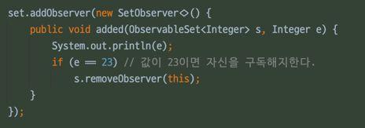

### 과도한 동기화는 피하라

응답 불가와 안전 실패로 피하려면 동기화 메서드나 동기화 블록 안에서는 제어를 절대로 클라이어느에 양도하면 안된다.

예를 들어 동기화된 영역 안에서는 재정의 할 수 있는 메서드는 호출하면 안되며,
클라이언트가 넘겨준 함수 객체를 호출해서도 안 된다.
동기화된 영역을 포함한 클래스 관점에서는 이런 메서드는 모두 바깥 세상에서 온 외계인이다.

외계인 메서드가 하는 일에 따라 동기화된 영역은 예외를 일으키거나, 교착상태에 빠지거나, 데이터를 훼손할 수도 있다.

- `재정의 할 수 있는 메서드`: 상속받은 override 메서드를 의미
- `클라이언트가 넘겨준 함수 객체`: @FunctionalInterface 를 구현한 함수 객체 를 의미

```

// 코드 79-1 잘못된 코드. 동기화 블록 안에서 외계인 메서드를 호출한다. (420쪽)
  private final List<SetObserver<E>> observers
          = new ArrayList<>();

  public void addObserver(SetObserver<E> observer) {
      synchronized(observers) {
          observers.add(observer);
      }
  }
  public boolean removeObserver(SetObserver<E> observer) {
      synchronized(observers) {
          return observers.remove(observer);
      }
  }

  private void notifyElementAdded(E element) {
      synchronized(observers) {
          for (SetObserver<E> observer : observers)
              observer.added(this, element); // 외계인 메서드 
      }
  }
```

```
// SetObserver 집합 관찰자 콜백 인터페이스 (421쪽)
@FunctionalInterface
public interface SetObserver<E> {
    // ObservableSet에 원소가 더해지면 호출된다.
    void added(ObservableSet<E> set, E element);
}
```

```java
public class Test1 {
    public static void main(String[] args) {
        ObservableSet<Integer> set =
                new ObservableSet<>(new HashSet<>());

        set.addObserver((s, e) -> System.out.println(e));

        for (int i = 0; i < 100; i++)
            set.add(i);
    }
}
```

```java
// ObservableSet 동작 확인 #2 - 정숫값이 23이면 자신의 구독을 해지한다. (422쪽)
public class Test2 {
    public static void main(String[] args) {
        ObservableSet<Integer> set =
                new ObservableSet<>(new HashSet<>());

        set.addObserver(new SetObserver<>() {
            public void added(ObservableSet<Integer> s, Integer e) {
                System.out.println(e);
                if (e == 23) // 값이 23이면 자신을 구독해지한다.
                    s.removeObserver(this);
            }
        });

        for (int i = 0; i < 100; i++)
            set.add(i);
    }
}
```

23까지 출력한 다음 ConcurrentModificationException 을 던진다.

관찰자의 added 메서드 호출이 일어난 시점이 notifyElementAdded 가 관찰자들의 리스트를 순회하는 도중이기 때문이다.




이번에는 removeObserver 를 직접 호출하지 않고 실행자 서비스 (ExecutorService) 를 사용해 다른 스레드한테 부탁할 것이다.

```
set.addObserver(new SetObserver<>() {
    public void added(ObservableSet<Integer> s, Integer e) {
        System.out.println(e);
        if (e == 23) {
            ExecutorService exec =
                    Executors.newSingleThreadExecutor();
            try {
                exec.submit(() -> s.removeObserver(this)).get();
            } catch (ExecutionException | InterruptedException ex) {
                throw new AssertionError(ex);
            } finally {
                exec.shutdown();
            }
        }
    }
});

```

이 실행은 예외가 발생하지는 않지만 교착 상태에 빠진다. 백그라운드 스레드가 s.removeObserver를 호출하면
관찰자를 잠그려 시도하지만 락을 얻을 수 없다.

메인 스레드가 이미 락을 쥐고 있기 때문이다. 그와 동시에 메인 스레드는 백그라운드 스레드가 관찰자를 제거하기만을 기다리는 중이다.
바로 교착상태다!

실제로 동기화된 영역 안에서 외계인 메서드를 호출하여 교착상태에 빠지는 사례가 자주 있다.

락에 대해서는 외계인 메서드 호출하는 부분을 동기화 밖으로 옮기면 된다.
관찰자 리스트를 복사해 쓰면 락 없이도 안전하게 순회할 수 있다. 


```
private final List<SetObserver<E>> observers =
        new CopyOnWriteArrayList<>();
private void notifyElementAdded(E element) {
    for (SetObserver<E> observer : observers)
        observer.added(this, element);
}
```

`열린 호출` : 동기화 영역 바깥에서 호출되는 외계인 메서드를 말한다.

얼마나 오래 실행 될지 모르는데 동기화 영역 안에서 호출된다면, 그동안 다른 스레드는 보호된 자원을 사용하지 못하고 
대기해야만 한다. 따라서 열린 호출은 실패 방지 효과외에도 동시성 효율을 크게 개선해준다.

**기본 규칙은 동기화 영역에서는 가능한 한 일을 적게 하는 것이다.**

### 과도한 동기화가 초래하는 진짜 비용은 락을 획득하는 데 있다.

멀티코어가 일반화된 오늘날, 과도한 동기화가 초래하는 진짜 비용은 락을 얻는 데 드는 CPU 시간이 아니다. 
바로 경쟁하느라 낭비하는 시간, 즉 병렬로 실행할 기회를 읽고, 모든 코어가 메모리를 일관되게 보기 위한 지연시간이 진짜 비용이다.

가상 머신의 코드 최적화를 제한한다는 점도 과도한 동기화의 또 다른 숨은 비용이다.


### 가변 클래스를 작성할 때

1. 동기화를 전혀 하지 말고, 그 클래스를 동시에 사용해야 하는 클래스가 외부에서 알아서 동기화 하게 하자.
2. 동기화를 내부에서 수행해 스페드 안전한 클래스로 만들자.

단 클라이언트가 외부에서 객체 전체에 락을 거는 것 보다 동시성을 월등히 개선할 수 있을 때만 두번째 방법을 선택해야 한다.


