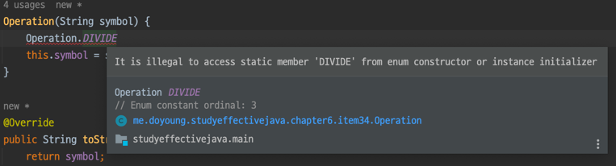

### int 상수 대신 열거 타입을 사용하라

``` java
class Orange {
   public static final int ORANGE_NAVEL = 0;
   public static final int ORANGE_BLOOD = 1;
   public static final int ORANGE_TEMPLE = 2;
}
```

위와 같이 정수 열거 패턴 을 사용하게 되면 단점이 있다.

1. 타입 안전 보장 X
    - 디버깅시 ORANGE_BLOOD 으로 보이는것이 아니라 1 인 값으로 보여서 도움이 되지 못한다.
2. 좋은 표현력 X
    - 정수 대신 문자열 상수를 사용하는 변형 패턴도 있지만 이는 하드코딩한 문자열에 오타가 있어도 컴파일러는 확인할 길이 없어 런타임 버그가 발생할 수 있다.

### 따라서 ENUM 을 사용한다.

```java
public enum Orange {NAVEL, BLOOD, TEMPLE}
```

- 열거 타입 자체는 **클래스**이며, 클라이언트가 인스턴스를 직접 생성하거나 확장할 수 없고
  상수 하나당 자신의 인스턴스를 하나씩 만들어 public static final 필드로 공개한다. (ex. 싱글톤, 열거타입은 인스턴스 통제)

- 상수임으로 == 으로도 비교할 수 있다.

- (단점 1 보완) 공개되는 것은 필드의 이름 뿐이라, 정수 열거 패턴과 달리 상수 값이 클라이언트로 컴파일 되지 않는다. (적합한 문자열을 내어줌)

- `Comparable`, `Serializable`을 구현했으며 그 직렬화 형태도 웬만한 변형을 가해도 문제 없이 동작한다.

- (단점 2 보완) 만약 열거 타입에서 상수를 하나 제거한다면 클라이언트에서는 컴파일 오류가 발생할 것 이다.

### 상수별 클래스 몸체와 데이터를 사용한 열거 타입

단순히 문자열이 아니라 abstract 메서드들을 활용해서 공통된 메서드를 담을 수 도 있다.

```java
public enum Operation {
    PLUS("+") {
        public double apply(double x, double y) {
            return x + y;
        }
    },
    MINUS("-") {
        public double apply(double x, double y) {
            return x - y;
        }
    },
    TIMES("*") {
        public double apply(double x, double y) {
            return x * y;
        }
    },
    DIVIDE("/") {
        public double apply(double x, double y) {
            return x / y;
        }
    };

    private final String symbol;

    Operation(String symbol) {
        this.symbol = symbol;
    }

    @Override
    public String toString() {
        return symbol;
    }

    public abstract double apply(double x, double y);

    // 코드 34-7 열거 타입용 fromString 메서드 구현하기 (216쪽)
    private static final Map<String, Operation> stringToEnum =
            Stream.of(values()).collect(
                    toMap(Object::toString, e -> e));

    // 지정한 문자열에 해당하는 Operation을 (존재한다면) 반환한다.
    public static Optional<Operation> fromString(String symbol) {
        return Optional.ofNullable(stringToEnum.get(symbol));
    }

    public static void main(String[] args) {
        double x = Double.parseDouble(args[0]);
        double y = Double.parseDouble(args[1]);
        for (Operation op : Operation.values())
            System.out.printf("%f %s %f = %f%n",
                    x, op, y, op.apply(x, y));
    }
}

```

열거 타입 상수는 생성자에서 자신의 인스턴스를 맵에 추가할 수 없다.
이렇게 하려면 컴파일 오류가 나는데, 만약 이 방법을 허용되었다면 런타임에 NullPointerException 이 발생한다.



### 전략 열거 타입 패턴


```
switch(this) {  
    case SATURDAY: case SUNDAY: // 주말
        return basePay / 2;
    default: 
        return (minutesWorked - MINS_PER_SHIFT) * payRate / 2;
}
```


만약 Enum 에 대해서 분류하는 switch 로직이 위와 같이 있다고 한다면
새로운 상수가 추가되었을 경우에는 무조건 default 로직으로 타게 될 것이고, 추가한 이는 switch 로직에 대해서 고려해보지 않고 이는 오류로 발생할 가능성이 높다.

따라서 switch 로직을 제거하고 switch 로 나눈 case 에 대해서 새로운 Enum 을 만드는 것이 전략 열거 타입 패턴이다.

```
enum PayType {
    WEEKDAY {
        int overtimePay(int minsWorked, int payRate) {
            return minsWorked <= MINS_PER_SHIFT ? 0 :
                    (minsWorked - MINS_PER_SHIFT) * payRate / 2;
        }
    },
    WEEKEND {
        int overtimePay(int minsWorked, int payRate) {
            return minsWorked * payRate / 2;
        }
    };

    abstract int overtimePay(int mins, int payRate);
    private static final int MINS_PER_SHIFT = 8 * 60;

    int pay(int minsWorked, int payRate) {
        int basePay = minsWorked * payRate;
        return basePay + overtimePay(minsWorked, payRate);
    }
}
```

이런식으로 작성하게 되면 새로운 상수가 추가할 때 기존에 switch 구문에 어디에 선택되게 할것인지를 선택하도록 하는 전략이 성공할 수 있다.

따라서 switch 문 보다 복잡하지만 더 안전하고 유연하다.


