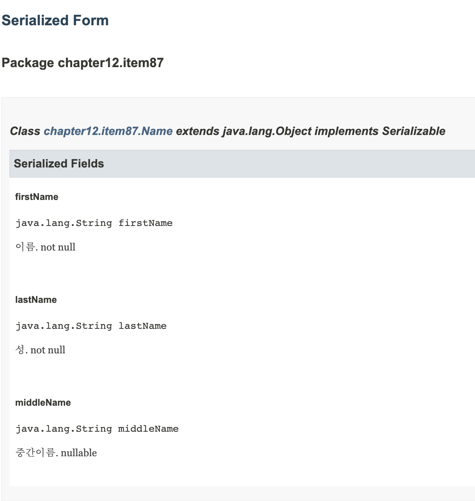

## item87 커스텀 직렬화 형태를 고려해보라

### 괜찮다고 판단될 떄만 기본 직렬화 형태를 사용하라
- 클래스가 `Serializable` 을 구현하고 기본 직렬화 형태를 사용하는 경우 다음 릴리스 때 현재의 구현이 영원히 발이 묶이게 된다
  - `BigInteger`, `BigDecimal` 에서도 이와 같은 문제가 발생함

### 객체의 물리적 표현과 논리적 표현이 같다면 기본 직렬화 형태라도 무방하다
- `chapter12.item87.Name` 

### 기본 직렬화 형태를 사용했음에도 불변식 보장과 보안을 위해 readObject를 제공해야할 떄가 많다
- 직렬화는 생성자를 통하지 않고 객체를 생성하기 때문에 불변식 보장과 보안을 위협하는 요소이다 

### 객체의 물리적 표현과 논리적 차이가 클 때 기본 직렬화를 사용할 때 나타나는 문제점 4가지
1. 공개 API가 현재의 내부 표현 방식에 영구히 묶인다
2. 너무 많은 공간을 차지할 수 있다
3. 시간이 너무 많이 걸릴 수 있다
4. 스택 오버 프롤를 일으킬 수 있다

### 합리적으로 직렬화하기 
- 객체 그래프를 탐색하지 말고 필요로 할 부분까지만 제공한다 -> 커스텀 직렬화 형태
  - `defaultWriteObject()`, `defaultReadObject()` -> transient  선언하지 않은 모든 인스턴스 필드에 대해 직렬화/역직렬화 
  - `transient` -> 기본 직렬화 대상이 아님을 지정하는 한정자(해당 객체의 논리적 상태와 무관한 필드일 경우 사용)
  
### 어떤 직렬화 형태를 택하든 직렬화 가능 클래스 모두에 직렬 버전 UID를 명시적으로 부여하자
- 직렬 버전 UID를 명시하지 않은 경우 런타임에 값을 무작위로 생성하는데 비용이 크다
- 직렬 버전 UID는 고유할 필요는 없고, 기존 클래스 호환성을 끊고 싶을 경우 변경하는 것으로 해결할 수 있다 
- 구버전으로 직렬화된 인스턴스와의 호환성을 끊으려는 경우를 제외하고는 직렬 버전 UID를 절대 수정하지 말 것

### Javadocs 직렬화 

- `@serial`: javadoc 필드 명시
- `@serialData` : javadoc 메서드 명시

### 정리 
- 자바의 기본 직렬화 형태는 객체 직렬화 결과가 해당 객체의 논리적 표현에 부합할 경우에만 사용하자
- 한번 공개된 메서드는 향후 릴리스에서 제거할 수 없듯이, 직렬화 형태에 포함된 필드도 마음대로 제거할 수 없다
- 잘못된 직렬화 형ㅌ는 클래스의 복잡성과 성능에 부정적인 영향을 남긴다