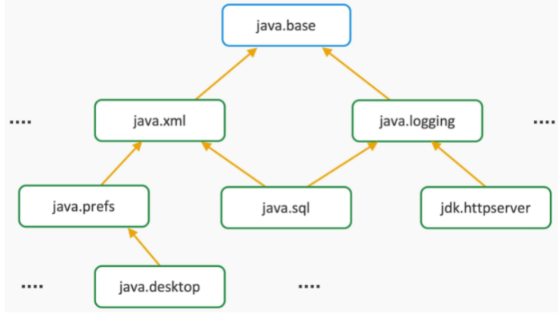
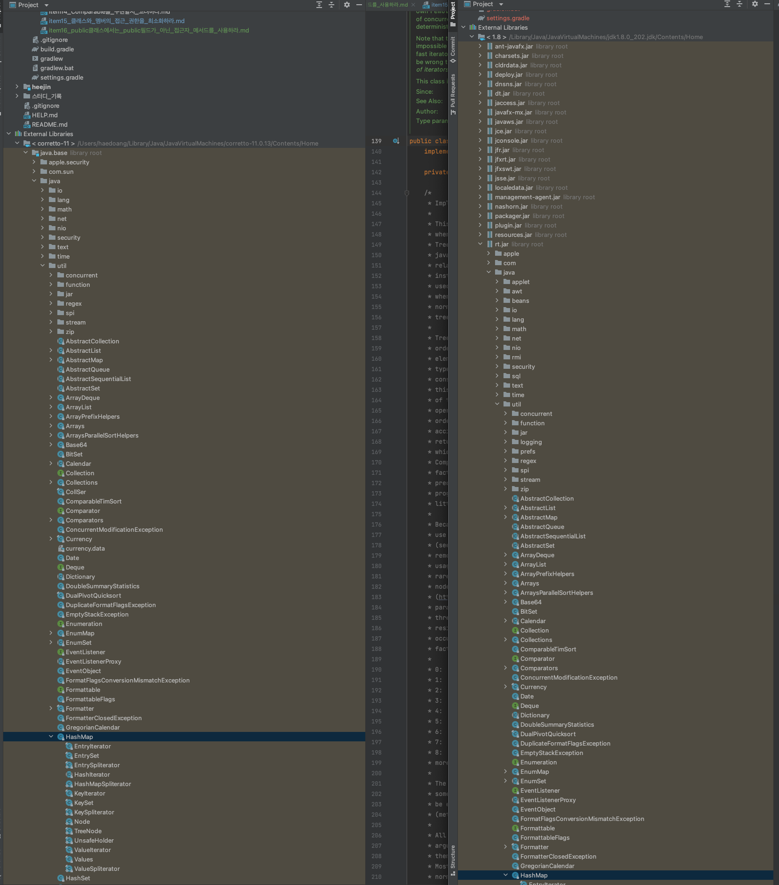
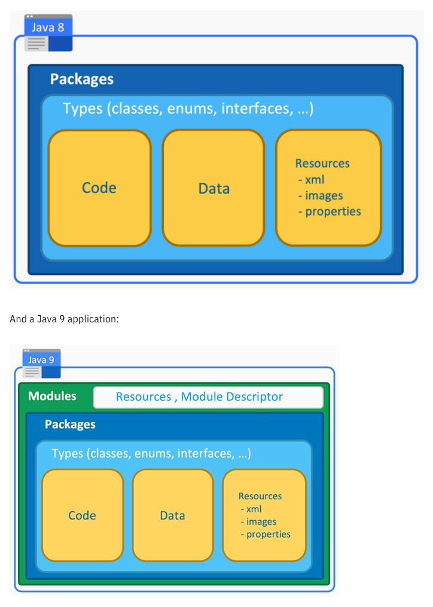

### item15 클래스와 멤버의 접근 권한을 최소화하라

#### 잘 설계된 컴포넌트란 
- 클래스 내부 데이터와 내부 구현 정보를 외부 컴포넌트로부터 얼마나 잘 숨겼는지(정보 은닉, 캡슐화)

#### 정보 은닉, 캡슐화를 통한 장점
- 시스템 개발 속도를 높인다. 여러 컴포넌트를 병렬로 개발할 수 있다
  - 객체 간의 결합도를 낮추는 캡슐화를 통해 객체를 작게 분리할 수 있다.
  - 작게 분리된 객체(독립적인)는 부품화가 가능해지므로, 병렬 개발로 시스템 개발속도를 높이고 성능을 최적화 할 수 있다
- 시스템 관리 비용을 낮춘다. 컴포넌트를 더빨리 파악할 수 있다
- 정보 은닉 자체가 성능을 높여주지는 않지만, 최적화에 도움을 준다
- 소프트웨어 재사용성을 높인다
- 큰 시스템을 제작하는 난이도를 낮춰준다

#### 정보 은닉/캡슐화 기본 원칙
- 모든 클래스와 멤버의 접근성을 가능한 한 좁혀야 한다
- 클래스의 공개 API를 세심히 설계한 후, 나머지 모든 멤버를 private으로 만든다
- 그런 다음 같은 패키지의 다른 클래스가 접그하는 경우 package-private으로 풀어준다
- 상위 클래스의 메서드를 재정의할 때는 그 접근 수준을 상위 클래스에서보다 좁게할 수 없다
- public 클래스의 인승턴스 필드는 되도록 public이 아니어야 한다
- public 가변 필드를 갖는 클래스는 스레드 안전하지 못하다
  - public static final 배열필드를 두거나 이 필드를 반환하는 접근제 마세드를 제공해서는 안된다

#### 클라이언트에게 배열 객체를 안전하게 제공하는 방법
1. `Collection.unmodifiableList()` 로 반환한다
   - 해당 메소드는 파라미터로 넘어온 객체를 변경 불가능한 객체로 프록시된 객체를 반환한다
2. `clone()`메서드를 사용한다
   - 사용자에게 제공되는 참조가능한 객체인 array를 clone()하여 분리시킨다

#### 모듈
- Java 9 이상부터 지원
- 모듈 이전의 시스템에서는 패키지에 대한 접근제어를 할 수 없었다.
- 모듈은 위와 같은 단점을 개선하도록 패키지 캡슐화를 가능하게 한다
  - `exports java.io;`
- jdk도 모듈로 제공된다
  > java --list-modules
  
##### Module Descriptor
- 모듈이 의존하는 모듈들과 export할 내용을 정의해야 한다 (내보낼 내용이 모듈이 제공하는 오브젝트)

#### base 모듈 구성

##### 모듈이 적용된 jdk 비교하기
- 최상위 구조가 package ex) `rt.jar`

- 최상위 구조가 module ex) `java.base`

##### 정리 
 - 기존 패키지 구조 방식에서는 패키지 단위의 접근제어가 불가능하여 패키지 단위의 캡슐화를 할 수 없었다
 - 초기의 자바 플랫폼은 라이브러리를 통합한 `rt.jar`(runtime.jar 라는 뜻)로 배포하였다
   - 단일 파일이라 불필요한 것까지 같이 배포되는 단점
   - pc에서는 무리가 아니지만 임베디드 장비 등에서 사용하기에는 적합하지 않은 구조
   - 런타임 시 필요하지 않은 클래스를 제거(리소스 낭비)하기 위한 `모듈` 도입
 - 모듈의 도입으로 암묵적인 접근 수준이 추가됨
   - 모듈 외부로 공개할 패키지: exports
   - 모듈 외부로 공개하지 않을 패키지: ~~exports~~

    
- 출처
  - [https://developer.ibm.com/tutorials/java-modularity-2/](https://developer.ibm.com/tutorials/java-modularity-2/)
