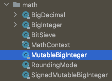

# 클래스와 인터페이스

[아이템 17. 변경 가능성을 최소화하라](#변경-가능성을-최소화하라)   
[- 불변 클래스로 만드는 방법](#불변-클래스로-만드는-방법)   
[- 불변 객체의 장점](#불변-객체의-장점)   
[- 불변 객체의 단점](#불변-객체의-단점)   
[- 불변 객체의 단점에 대한 해결책](#불변-객체의-단점에-대한-해결책)   
[- 불변 클래스를 만드는 설계 방법](#불변-클래스를-만드는-설계-방법)   
[- 정리](#정리)   

<br>

## 변경 가능성을 최소화하라
- 불변 클래스란 그 인스턴스의 내부 값을 수정할 수 없는 클래스다.
- 불변 클래스는 가변 클래스보다 설계하고 구현하고 사용하기 쉬우며, 오류가 생길 여지도 적고 훨씬 안전하다.

### 불변 클래스로 만드는 방법
1. 객체의 상태를 변경하는 메서드(변경자)를 제공하지 않는다.
   - setter 뿐만 아니라 메서드 내부에서 객체의 상태를 변경하지 않아야 한다.
2. 클래스를 확장할 수 없도록 한다.
   - 클래스를 final로 선언
   - 생성자를 private으로 제한하고, 정적 팩터리 메서드를 통해 인스턴스 생성
3. 모든 필드를 `final`로 선언한다.
4. 모든 필드를 `private`으로 선언한다.
5. 자신 외에는 내부의 가변 컴포넌트에 접근할 수 없도록 한다. - [예제](../../src/test/java/study/heejin/chapter4/Item17Test.java)
   - 불변 클래스에 가변 객체를 참조하는 필드가 있으면, 가변 객체가 변경됨에 따라 불변 클래스가 깨질 수 있으므로 주의해야 한다.
   - 가변 객체는 그 객체의 참조를 얻을 수 없도록 해야 한다.   
     `member.getAddress()` 와 같은 객체 참조 X
   - 가변 객체를 참조를 반환해서도 안된다.
   - 가변 객체인 경우 생성자, 접근자, readObject 메서드 모두에서 방어적 복사를 수행해야 한다.


### 불변 객체의 장점
  - 불변 객체는 단순하다.
  - 불변 객체는 생성된 시점의 상태를 파괴될 때까지 그대로 간직한다.
  - 불변 객체는 근본적으로 스레드 안전하여 따로 동기화할 필요가 없다.
  - 불변 객체는 안심하고 공유할 수 있다.
  - 불변 객체끼리는 내부 데이터를 공유할 수 있다.

  - 불변 클래스라면 인스턴스를 최대한 재활용하기를 권한다.  
    가장 쉬운 재활용 방법은 자주 쓰이는 값들을 상수로 제공하는 것이다.
    ```java
    private static final Complex ZERO = new Complex(0, 0);
    private static final Complex ONE = new Complex(1, 0);
    private static final Complex I = new Complex(0, 1);
    ```
  - 객체를 만들 때 다른 불변 객체들을 구성요소로 사용하면 이점이 많다.  
    예로, 불변 객체는 맵의 키와 집합(Set)의 원소로 쓰기에 안성맞춤이다.
  - 불변 객체는 그 자체로 실패 원자성을 제공한다. *(→ item 76)*


### 불변 객체의 단점
  - 값이 다르면 반드시 독립된 객체로 만들어야 한다.
  - 객체를 완성하기까지 단계가 많고, 중간 단계의 객체들이 모두 버려지면 성능문제가 생길 수 있다.
  

#### 불변 객체의 단점에 대한 해결책

1. 다단계 연산(multistep operation)들을 예측하여 기본 기능으로 제공하는 방법  
- 이러한 다단계 연산을 기본으로 제공한다면 더 이상 각 단계마다 객체를 생성하지 않아도 된다.  
  - 예를들어, `BigInteger`는 모듈러 지수 같은 다단계 연산 속도를 높여주는 가변 동반 클래스를 `package-private`으로 두고 있다.  
      
    `class MutableBigInteger { ... }`
  
2. 다단계 연산들이 예측이 안될 때
- 다단계 연산 속도를 높여주는 가변 동반클래스를 `public`으로 둔다.
  - 예를들어, String 클래스의 연산속도를 높여주기 위한 `StringBuilder`, `StringBuffer`가 있다.  
    `public final class StringBuilder extends .. implements .. { ... }`

> 가변 동반 클래스란?  
> 불변 클래스와 거의 동일한 기능을 가지고 있지만 가변적인 클래스를 가변 동반 클래스라고 한다.


### 불변 클래스를 만드는 설계 방법
- 클래스가 불변임을 보장하려면 상속하지 못하게 해야 한다.
  - 상속하지 못하게 하는 가장 쉬운 방법은 final 클래스로 선언하는 것이다.
  - 또 다른 방법으로, 정적 팩터리를 제공하는 방법이다.  
    정적 팩터리 방식은 유연성을 제공하고, 객체 캐싱 기능을 추가해 성능을 끌어올릴 수도 있다.

- `BigInteger`, `BigDecial` 은 이 방법을 지키지 못해서 상속이 허용된다.
  - 그러니 만약 신뢰할 수 없는 클라이언트로부터 BigInteger나 BigDecimal 인스턴스를 인수로 받는다면 주의해야 한다.
  - 신뢰할 수 없는 인수들은 가변이라 가정하고 방어적으로 ㅂ고사해서 사용해야 한다.
  ````java
  public static BigInteger safeInstance(BigInteger bi) {
      return bi.getClass() == BigInteger.class ? 
              bi : new BigInteger(bi.toByteArray());
  }
  ````

- 하지만 성능을 위해 이 규칙을 완화할 수 있다.
  - 계산 비용이 큰 값을 처음에 계산하여 final이 아닌 필드에 캐시해 놓기도 한다.
  - 똑같은 값을 다시 요청하면 캐시해둔 값을 반환하여 계산 비용을 절감하는 것이다.


### 정리
- `getter`가 있다고 해서 무조건 `setter`를 만들지 말자.
- 클래스는 꼭 필요한 경우가 아니라면 불변이어야 한다.
- 단순한 값 객체는 항상 불변으로 만들자.
- 성능 때문에 어쩔 수 없다면 불변 클래스와 쌍을 이루는 가변 동반 클래스를 public 클래스로 제공하자. *(→ item 67)*
- 불변으로 만들 수 없는 클래스라도 변경할 수 있는 부분을 최소한으로 줄이자.
  - java.util.concurrent 패키지의 `CountDownLatch` 클래스는 비록 가변 클래스지만 가질 수 있는 상태의 수가 많지 않다.  
    인스턴스를 생성해 한 번 사용하고 그걸로 끝이다. 카운트가 0에 도달하면 더는 재사용할 수 없는 것이다.
- 다른 합당한 이유가 없다면 모든 필드는 `private final` 이어야 한다.
- 생성자는 불변식 설정이 모두 완료된, 초기화가 완벽히 끝난 상태의 객체를 생성해야 한다.

<br>

---
#### Reference

- [[이펙티브자바] Item17. 변경 가능성을 최소화 하라](https://junseokdev.tistory.com/34)
- [[아이템 17] 다단계 연산, 가변 동반클래스](https://github.com/Java-Bom/ReadingRecord/issues/47#issuecomment-589920838)

